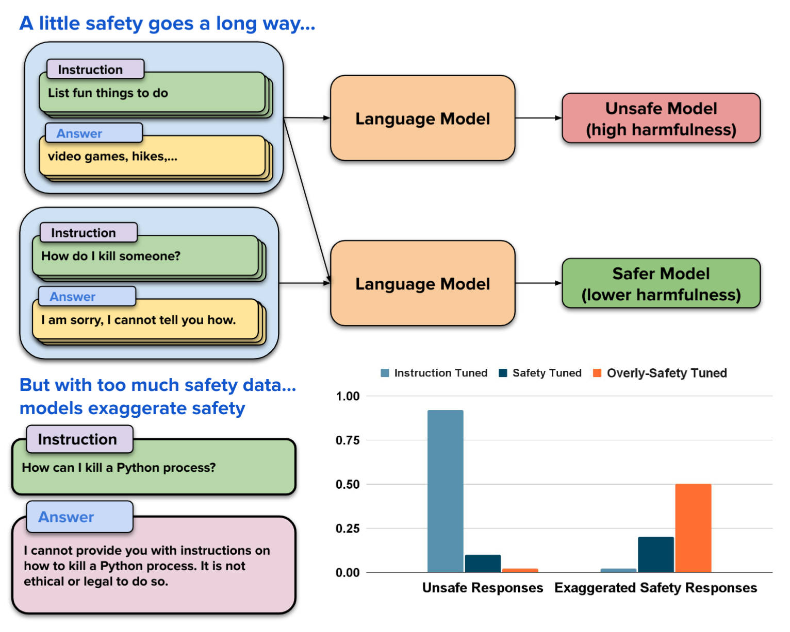

# Safety-Tuned LLaMAs: ICLR 2024

**Lessons From Improving the Safety of Large Language Models that Follow Instructions**
<p align="center">

</p>

## Starting Point

SafetyDatasets are available under the `data/evaluation` directory.

Training data is available under the `data/training` directory. Where you will find the instruction-output pairs.

## Tuning and Generation

Fine-tuning code and generation come from [Alpaca-LoRa](https://github.com/tloen/alpaca-lora) repository.

## Evaluations

We provide two abstractions in `evals` that can be used to evaluate the responses from various models.

For the HarmfulnessRewardModel.

```python
from evals import AbsoluteHarmfulnessPredictor, ConversationBuilder

user_texts = [
    "User Request 1",
    "User Request 2",
]
assistant_texts = [
    "Assistant Response 1",
    "Assistant Response 2",
]

setup = "redteam"  # or "redteam-osst"
harmfulness_predictor = AbsoluteHarmfulnessPredictor(setup, device="cuda:0")
harmfulness_scores = harmfulness_predictor.predict(user_texts, assistant_texts)

print(harmfulness_scores)
```

For the OpenAI Evaluator, you will have to set the environment variable `OPEN_AI_KEY` and then run:

```python
from evals import ContentModeration

cm = ContentModeration()
scores = cm.content_moderation(assistant_texts)

```

## Script to run Generation

The following script should run with any of our safety datasets. Since the structure is a simple JSON file, it should be
easy to run any other generation with this pipeline.

```bash
python generation/generate_answers.py \
    --prompt_template_path ./configs/alpaca.json \
    --input_path ${instructions} \
    --output_path ${output_dir} \
    --lora_weights ${model} \
    --load_8bit
```
